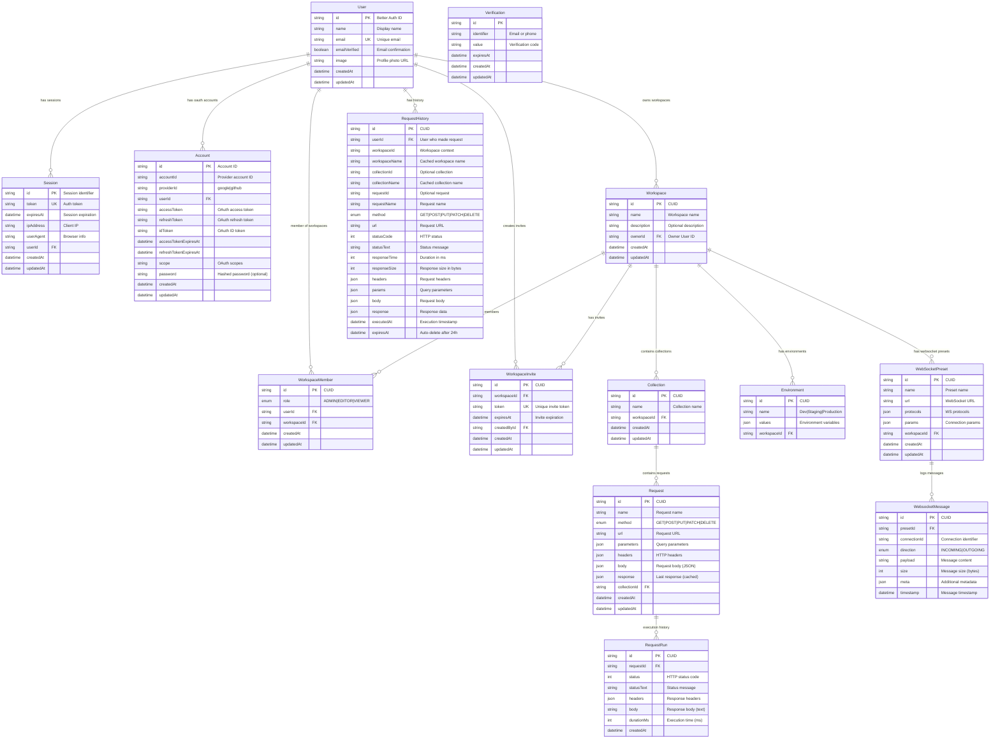

# Database Design - PostBoy API Testing Platform

**Version:** 2.0.0  
**Database:** PostgreSQL 16+  
**ORM:** Prisma v6.16.2  
**Last Updated:** October 3, 2025

---

## 📋 Table of Contents

1. [Overview](#overview)
2. [Entity Relationship Diagram](#entity-relationship-diagram)
3. [Core Modules](#core-modules)
4. [Detailed Schema](#detailed-schema)
5. [Relationships & Constraints](#relationships--constraints)
6. [Indexes & Performance](#indexes--performance)
7. [Security Considerations](#security-considerations)
8. [Data Lifecycle](#data-lifecycle)

---

## Overview

PostBoy is a comprehensive API testing platform built with Next.js 15.5.4 and Prisma ORM. The database architecture supports a modern, scalable, and secure multi-tenant system.

### Key Features
- ✅ **Multi-tenancy**: Workspace-based isolation with complete data separation
- ✅ **Role-Based Access Control**: ADMIN, EDITOR, VIEWER permissions
- ✅ **Auto-expiring History**: 24-hour request history with automatic cleanup
- ✅ **AI Integration**: Request naming, JSON generation, API documentation
- ✅ **Real-time WebSocket**: Message logging and connection management
- ✅ **OAuth Authentication**: Google and GitHub integration
- ✅ **JSON Flexibility**: Supports dynamic headers, parameters, and bodies
- ✅ **Performance Optimized**: Strategic indexes for fast queries

### Technology Stack
- **Database**: PostgreSQL 16+ (JSONB support required)
- **ORM**: Prisma v6.16.2
- **Authentication**: Better Auth v1.3.23
- **ID Strategy**: CUID for application entities, custom IDs for auth
- **Connection Pooling**: Built-in Prisma connection management

---

## Entity Relationship Diagram

### Complete System ERD



---

## Core Modules

### 1. Authentication Module
**Purpose**: Manage user authentication and authorization using Better Auth

**Entities**:
- `User`: Core user profile
- `Session`: Active user sessions with token management
- `Account`: OAuth provider accounts (Google, GitHub)
- `Verification`: Email/phone verification codes

**Key Features**:
- OAuth 2.0 integration
- Session management with automatic expiration
- Multiple OAuth provider support
- Email verification workflow

---

### 2. Workspace Module
**Purpose**: Multi-tenant workspace management with role-based access

**Entities**:
- `Workspace`: Isolated workspace containers
- `WorkspaceMember`: User-workspace relationships with roles
- `WorkspaceInvite`: Invitation system with expiring tokens

**Roles & Permissions**:
- **ADMIN**: Full workspace control (delete, invite, manage all)
- **EDITOR**: Create/edit collections and requests
- **VIEWER**: Read-only access to workspace content

**Key Features**:
- Complete data isolation between workspaces
- Unique workspace names per owner
- Cascading deletes for workspace cleanup
- Time-limited invite tokens

---

### 3. API Testing Module
**Purpose**: Organize and execute REST API requests

**Entities**:
- `Collection`: Logical grouping of related requests
- `Request`: Individual API request configurations
- `RequestRun`: Historical execution records

**Supported Methods**:
- GET, POST, PUT, PATCH, DELETE

**Key Features**:
- JSON storage for flexible headers/parameters/body
- Auto-save functionality (debounced)
- Response caching for quick reference
- Execution history tracking
- Support for complex nested JSON bodies

---

### 4. Request History Module (Auto-expiring)
**Purpose**: Track recent API executions with automatic cleanup

**Entity**:
- `RequestHistory`: Comprehensive execution records

**Key Features**:
- **24-hour auto-expiry**: Automatic deletion after 24 hours
- **Denormalized data**: Caches workspace/collection names for fast queries
- **Full request/response capture**: Complete execution details
- **Performance metrics**: Response time and size tracking
- **Indexed queries**: Optimized for user and workspace filtering

**Use Cases**:
- Debug recent API calls
- Monitor response times
- Review request patterns
- Troubleshoot failed requests

---

### 5. Environment Module
**Purpose**: Manage environment-specific variables

**Entity**:
- `Environment`: Key-value pairs for different environments

**Key Features**:
- JSON storage for flexible variable structure
- Environment-specific configurations (Dev, Staging, Production)
- Variable interpolation in requests
- Workspace-scoped environments

---

### 6. WebSocket Module
**Purpose**: Test and monitor WebSocket connections

**Entities**:
- `WebSocketPreset`: Saved WebSocket connection configurations
- `WebsocketMessage`: Logged messages for debugging

**Key Features**:
- Bidirectional message logging (INCOMING/OUTGOING)
- Connection preset management
- Message metadata storage
- Protocol and parameter configuration

---

## Detailed Schema

### User Table
```prisma
model User {
  id            String    @id
  name          String
  email         String    @unique
  emailVerified Boolean   @default(false)
  image         String?
  createdAt     DateTime  @default(now())
  updatedAt     DateTime  @default(now()) @updatedAt

  // Relations
  sessions         Session[]
  accounts         Account[]
  workspaces       Workspace[]       @relation("UserWorkspaces")
  memberships      WorkspaceMember[]
  workspaceInvites WorkspaceInvite[]
  requestHistory   RequestHistory[]
}
```

**Constraints**:
- `email` must be unique
- `id` is provided by Better Auth

**Business Rules**:
- Users can own multiple workspaces
- Users can be members of multiple workspaces with different roles
- User deletion cascades to all related entities

---

### Workspace Table
```prisma
model Workspace {
  id          String      @id @default(cuid())
  name        String
  description String?
  ownerId     String      
  owner       User        @relation("UserWorkspaces", fields: [ownerId], references: [id])

  // Relations
  collections      Collection[]
  members          WorkspaceMember[]
  invites          WorkspaceInvite[]
  environments     Environment[]
  websocketPresets WebSocketPreset[]
  
  createdAt   DateTime @default(now())
  updatedAt   DateTime @default(now()) @updatedAt

  @@unique([name, ownerId])
}
```

**Constraints**:
- Unique workspace name per owner
- Owner must be a valid User

**Business Rules**:
- Each workspace has exactly one owner
- Workspace deletion cascades to all collections, environments, and presets
- Owner is automatically an ADMIN member

---

### WorkspaceMember Table
```prisma
model WorkspaceMember {
  id          String      @id @default(cuid())
  role        MEMBER_ROLE @default(ADMIN)

  userId      String
  workspaceId String

  user      User      @relation(fields: [userId], references: [id])
  workspace Workspace @relation(fields: [workspaceId], references: [id])

  createdAt DateTime @default(now())
  updatedAt DateTime @default(now()) @updatedAt

  @@unique([userId, workspaceId])
}

enum MEMBER_ROLE {
  ADMIN
  EDITOR
  VIEWER
}
```

**Constraints**:
- Unique user-workspace combination (user can only have one role per workspace)
- User and Workspace must exist

**Business Rules**:
- ADMIN can manage workspace members and settings
- EDITOR can create/modify collections and requests
- VIEWER has read-only access

---

### Collection Table
```prisma
model Collection {
  id          String     @id @default(cuid())
  name        String

  workspaceId String
  workspace   Workspace  @relation(fields: [workspaceId], references: [id], onDelete: Cascade)
  requests    Request[]

  createdAt   DateTime   @default(now())
  updatedAt   DateTime   @default(now()) @updatedAt
}
```

**Constraints**:
- Workspace must exist
- Cascading delete when workspace is deleted

**Business Rules**:
- Collections organize related API requests
- Deletion cascades to all requests in the collection

---

### Request Table
```prisma
model Request {
  id          String      @id @default(cuid())
  name        String
  method      REST_METHOD @default(GET)
  url         String
  parameters  Json?       // Query parameters
  headers     Json?       // HTTP headers
  body        Json?       // Request body
  response    Json?       // Last cached response

  collectionId String
  collection   Collection  @relation(fields: [collectionId], references: [id], onDelete: Cascade)
  runs         RequestRun[]

  createdAt   DateTime     @default(now())
  updatedAt   DateTime     @default(now()) @updatedAt
}

enum REST_METHOD {
  GET
  POST
  PUT
  PATCH
  DELETE
}
```

**JSON Fields**:
- `parameters`: `{ "key": "value", "page": "1" }`
- `headers`: `{ "Content-Type": "application/json", "Authorization": "Bearer token" }`
- `body`: Any valid JSON object
- `response`: Cached last response for quick reference

**Business Rules**:
- Request name can be auto-suggested by AI
- Body can be AI-generated based on prompt
- Supports nested JSON structures
- Auto-save functionality with debouncing

---

### RequestRun Table
```prisma
model RequestRun {
  id         String   @id @default(cuid())

  requestId  String
  request    Request  @relation(fields: [requestId], references: [id], onDelete: Cascade)

  status     Int          // HTTP status code (200, 404, 500, etc.)
  statusText String?      // Status text ("OK", "Not Found", etc.)
  headers    Json?        // Response headers
  body       String?      // Response body (text or JSON string)
  durationMs Int?         // Execution time in milliseconds

  createdAt  DateTime @default(now())
}
```

**Purpose**: Track every execution of a request for debugging and history

**Business Rules**:
- New record created for each request execution
- Stores complete response details
- Includes execution time for performance monitoring
- Never deleted (permanent history within app lifecycle)

---

### RequestHistory Table (Auto-expiring)
```prisma
model RequestHistory {
  id            String      @id @default(cuid())
  
  // User who made the request
  userId        String
  user          User        @relation(fields: [userId], references: [id], onDelete: Cascade)
  
  // Workspace context (denormalized for performance)
  workspaceId   String
  workspaceName String
  
  // Collection context (optional, denormalized)
  collectionId  String?
  collectionName String?
  
  // Request details
  requestId     String?
  requestName   String
  method        REST_METHOD
  url           String
  
  // Response details
  statusCode    Int?
  statusText    String?
  responseTime  Int?        // in milliseconds
  responseSize  Int?        // in bytes
  
  // Full request/response metadata
  headers       Json?
  params        Json?
  body          Json?
  response      Json?
  
  // Timestamps
  executedAt    DateTime    @default(now())
  expiresAt     DateTime    // Set to executedAt + 24 hours
  
  @@index([userId, executedAt])
  @@index([workspaceId, executedAt])
  @@index([expiresAt])
}
```

**Key Features**:
- **Auto-expiry**: `expiresAt` field triggers automatic deletion after 24 hours
- **Denormalized data**: Stores workspace/collection names to avoid joins
- **Full capture**: Complete request and response for debugging
- **Performance tracking**: Response time and size metrics

**Indexes**:
- `[userId, executedAt]`: Fast user history queries
- `[workspaceId, executedAt]`: Fast workspace history queries
- `[expiresAt]`: Efficient cleanup queries

**Business Rules**:
- Created automatically when any request is executed
- Expires exactly 24 hours after execution
- Periodic cleanup job (cron) removes expired entries
- Supports both saved and unsaved requests

---

### Environment Table
```prisma
model Environment {
  id          String     @id @default(cuid())
  name        String     // "Development", "Staging", "Production"
  values      Json       // { "BASE_URL": "https://api.dev.com", "API_KEY": "abc123" }

  workspaceId String
  workspace   Workspace  @relation(fields: [workspaceId], references: [id], onDelete: Cascade)
}
```

**JSON Structure Example**:
```json
{
  "BASE_URL": "https://api.example.com",
  "API_KEY": "your_api_key",
  "AUTH_TOKEN": "Bearer token123",
  "TIMEOUT": 5000
}
```

**Business Rules**:
- Multiple environments per workspace
- Variables can be referenced in requests using `{{VAR_NAME}}` syntax
- Deletion cascades when workspace is deleted

---

### WebSocketPreset Table
```prisma
model WebSocketPreset {
  id         String   @id @default(cuid())
  name       String
  url        String   // "wss://example.com/socket"
  protocols  Json?    // WebSocket protocols
  params     Json?    // Connection parameters
  
  workspaceId String? 
  workspace   Workspace? @relation(fields: [workspaceId], references: [id], onDelete: SetNull)

  websocketMessages WebsocketMessage[]
  
  createdAt  DateTime @default(now())
  updatedAt  DateTime @updatedAt
}
```

**Business Rules**:
- Stores WebSocket connection configurations
- Can be workspace-specific or global
- SetNull on workspace delete (preserves preset)

---

### WebsocketMessage Table
```prisma
model WebsocketMessage {
  id          String    @id @default(cuid())
  presetId    String? 
  connectionId String?
  direction   DIRECTION @default(INCOMING)
  payload     String?   // Message content
  size        Int?      // Message size in bytes
  timestamp   DateTime  @default(now())

  preset      WebSocketPreset? @relation(fields: [presetId], references: [id], onDelete: SetNull)
  meta        Json?     // Additional metadata
}

enum DIRECTION {
  INCOMING
  OUTGOING
}
```

**Business Rules**:
- Logs all WebSocket messages for debugging
- Tracks message direction (client-to-server or server-to-client)
- Stores message size for performance analysis
- Metadata can include custom debug information

---

## Relationships & Constraints

### Primary Key Strategy
- **Better Auth Models** (User, Session, Account): Custom string IDs
- **Application Models**: CUID generated by `@default(cuid())`

### Foreign Key Cascading Rules

| Parent Table | Child Table | Delete Action | Reason |
|--------------|-------------|---------------|---------|
| User | Session | CASCADE | Sessions belong to user |
| User | Account | CASCADE | OAuth accounts belong to user |
| User | RequestHistory | CASCADE | History belongs to user |
| Workspace | Collection | CASCADE | Collections are workspace-specific |
| Workspace | WorkspaceMember | CASCADE | Membership is workspace-specific |
| Workspace | Environment | CASCADE | Environments are workspace-specific |
| Workspace | WebSocketPreset | SET NULL | Preserve presets after workspace deletion |
| Collection | Request | CASCADE | Requests belong to collection |
| Request | RequestRun | CASCADE | Runs belong to request |
| WebSocketPreset | WebsocketMessage | SET NULL | Preserve messages after preset deletion |

### Unique Constraints

| Table | Columns | Purpose |
|-------|---------|---------|
| User | email | One account per email |
| Session | token | Unique session tokens |
| Workspace | [name, ownerId] | Unique workspace names per owner |
| WorkspaceMember | [userId, workspaceId] | One role per user per workspace |
| WorkspaceInvite | token | Unique invite tokens |

---

## Indexes & Performance

### Strategic Indexes

```prisma
// RequestHistory - High-query table
@@index([userId, executedAt])          // User's recent history
@@index([workspaceId, executedAt])     // Workspace history
@@index([expiresAt])                   // Cleanup queries

// WorkspaceMember - Frequent lookups
@@index([userId])                      // User's workspaces
@@index([workspaceId])                 // Workspace members
@@unique([userId, workspaceId])        // Prevent duplicates
```

### Query Optimization Tips

1. **Avoid N+1 Queries**: Use Prisma `include` or `select` for related data
2. **Paginate Large Results**: Always use `take` and `skip` for history queries
3. **Use Indexes**: Query on indexed columns (userId, workspaceId, executedAt)
4. **Denormalize When Needed**: RequestHistory stores names to avoid joins
5. **Clean Up Regularly**: Run cleanup job for expired history entries

### Performance Benchmarks
- **User History Query**: <50ms (indexed)
- **Workspace History Query**: <100ms (indexed)
- **Request Execution**: <200ms (including DB save)
- **Cleanup Job**: <1s for 10,000 expired records

---

## Security Considerations

### Data Protection

1. **OAuth Tokens**: Never expose in API responses
2. **Password Hashing**: If password auth is enabled, use bcrypt
3. **Session Tokens**: Secure, httpOnly cookies
4. **JSONB Validation**: Sanitize user input before storing in JSON fields

### Access Control

1. **Workspace Isolation**: Users can only access workspaces they're members of
2. **Role-Based Permissions**: Enforce ADMIN/EDITOR/VIEWER rules in server actions
3. **Invite Token Expiration**: Time-limited workspace invites
4. **Session Expiration**: Automatic logout after inactivity

### SQL Injection Prevention

✅ **Prisma ORM** automatically prevents SQL injection through parameterized queries
✅ **Never** use raw SQL with user input without sanitization

---

## Data Lifecycle

### Request History Auto-Expiry Flow


### Workspace Deletion Flow


### User Deletion Flow


---

## Migration Strategy

### Database Migrations

Prisma manages schema changes through migrations:

```bash
# Create migration
npx prisma migrate dev --name add_request_history

# Apply to production
npx prisma migrate deploy

# Reset database (dev only)
npx prisma migrate reset
```

### Existing Migrations

1. **Initial Setup**: Core auth and workspace models
2. **RequestHistory Addition**: Auto-expiring history tracking (Oct 3, 2025)
3. **WebSocket Module**: WebSocket preset and message logging

---

## Backup & Recovery

### Backup Strategy

1. **Daily Automated Backups**: PostgreSQL pg_dump
2. **Point-in-Time Recovery**: WAL archiving enabled
3. **Retention Policy**: 30 days of daily backups

### Critical Data Priority

1. **User accounts and profiles** (highest priority)
2. **Workspace configurations**
3. **Collections and requests**
4. **Request history** (24-hour TTL, lower priority)
5. **WebSocket messages** (debugging only, lowest priority)

---

## Future Enhancements

### Planned Features

1. **Request Scheduling**: Cron-based automated request execution
2. **API Monitoring**: Uptime tracking and alerting
3. **Mock Servers**: Built-in mock API responses
4. **GraphQL Support**: GraphQL query builder and execution
5. **Team Analytics**: Usage metrics and performance dashboards
6. **Export/Import**: Backup collections in JSON/YAML format

### Scalability Considerations

1. **Read Replicas**: For high-traffic workspaces
2. **Sharding**: By workspace for horizontal scaling
3. **Caching Layer**: Redis for frequently accessed data
4. **CDN**: For static assets and AI-generated docs

---

## Conclusion

The PostBoy database design provides a robust, scalable foundation for a modern API testing platform. Key strengths:

✅ **Multi-tenant Architecture**: Complete workspace isolation  
✅ **Flexible JSON Storage**: Dynamic request/response structures  
✅ **Auto-expiring History**: Automatic cleanup for compliance  
✅ **Role-Based Access**: Secure collaboration features  
✅ **AI-Ready**: Structured data for AI-powered suggestions  
✅ **Performance Optimized**: Strategic indexes and denormalization  

---

**Document Version:** 2.0.0  
**Last Updated:** October 3, 2025  
**Next Review:** December 2025
